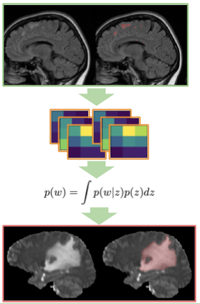

Pytorch implementation of the paper [Bayesian Generative Models for Knowledge Transfer in MRI Semantic Segmentation Problems](https://www.frontiersin.org/articles/10.3389/fnins.2019.00844/full)

We use Deep Weight Prior (DWP) [1] to perform **transfer learning** from large source to the smaller target dataset with medical images. 

We use a common benchmark - BRATS18 [2] as a target and MS [3] dataset as source dataset. 
   




The method perform better that randomly initialized and fine-tuned models. 


[1] Atanov, A., Ashukha, A., Struminsky, K., Vetrov, D., and Welling, M. (2018). The deep weight prior.

[2] Menze, B. H., Jakab, A., Bauer, S., Kalpathy-Cramer, J., Farahani, K., Kirby, J., et al. (2015). The multimodal brain tumor image segmentation benchmark (brats). 

[3] CoBrain analytics, (2018). Multiple Sclerosis Human Brain MR Imaging Dataset


# Experiments
## Environment setup
The code is base on `PyTorch 1.5.0` and `PyTorch-Lightning 0.8.0`. 
The exact specification of our environment is provided in the file `environment.yml` and
can be created via 
```bash
conda env create -f environment.yml
```

## Example on toy dataset
- Load Source and target dataset into `data/dataset_name` folders. 
Below are examples for `MNIST` abd `notMNIST` datasets (they will be loaded automatically)

- Train N models on the source dataset. Here full notMNIST dataset is used  
```bash
python3 train.py --dataset_name notMNIST --trian_size -1 
```

- Train VAE on the kernels
```bash
python3 train_vae.py --kernel_size 7
```

- Train model on the target dataset with VAE from the previous step as a prior
```bash
python3 train.py --dataset_name MNIST --prior notMNIST --trian_size 100 
```

# Citation
If you find our paper or code useful, feel free to cite the [paper]((https://www.frontiersin.org/articles/10.3389/fnins.2019.00844/full):
```text
@article{kuzina2019bayesian,
  title={Bayesian generative models for knowledge transfer in mri semantic segmentation problems},
  author={Kuzina, Anna and Egorov, Evgenii and Burnaev, Evgeny},
  journal={Frontiers in neuroscience},
  volume={13},
  pages={844},
  year={2019},
  publisher={Frontiers}
} 
```


